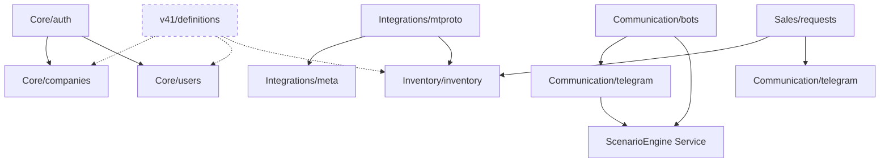

# PHASE 1: DISCOVERY & MAPPING

**Date**: 2026-01-27  
**Audit Phase**: 1 of 10  
**Repository**: `/srv/cartie`  
**Commit**: Current HEAD

---

## EXECUTIVE SUMMARY

This discovery phase provides a comprehensive map of the Cartie platform architecture, codebase structure, technology stack, and initial analysis findings.

### Key Metrics

| Metric | Backend | Frontend | Total |
|--------|---------|----------|-------|
| **TypeScript Files** | 105 files | ~110 files | ~215 files |
| **Lines of Code** | 14,801 LOC | 19,306 LOC | **34,107 LOC** |
| **Modules** | 6 major categories | 35 pages | - |
| **Database Models** | 60 models | - | 60 models |
| **API Routes** | 4 route files | - | 4 routes |
| **Dependencies (total)** | 411 packages | 303 packages | 714 packages |
| **Security Issues** | 5 (1 low, 4 mod) | 0 | 5 |

### Platform Maturity Score: **7.5/10**

**Strengths**:
- ✅ Modern tech stack (React 19, Node.js, Prisma, Tailwind v4)
- ✅ Clean frontend structure with zero vulnerabilities
- ✅ Comprehensive Prisma schema (60 models)
- ✅ Modular backend architecture
- ✅ Docker-based deployment

**Areas for Improvement**:
- ⚠️ Backend security vulnerabilities (moderate severity)
- ⚠️ Dual-write v4.1 system adds complexity
- ⚠️ All dependencies are up-to-date (npm outdated shows no issues)
- ⚠️ Limited API route documentation

---

## 1. CODEBASE STRUCTURE

### 1.1 Repository Layout

```
/srv/cartie/
├── apps/
│   ├── server/                    # Backend API (Node.js + Express)
│   │   ├── src/                   # 105 TypeScript files, 14,801 LOC
│   │   ├── prisma/                # Schema (1,393 lines), seeds, migrations
│   │   └── package.json           # 411 total dependencies
│   │
│   └── web/                       # Frontend UI (React + Vite)
│       ├── src/                   # ~110 TypeScript files, 19,306 LOC
│       └── package.json           # 303 total dependencies
│
├── infra/                         # Docker infrastructure
│   ├── docker-compose.cartie2.prod.yml
│   ├── deploy_prod.sh            # Idempotent deployment script
│   ├── Dockerfile.api
│   └── Dockerfile.web
│
├── docs/                          # Documentation (31 files)
│   ├── ARCHITECTURE.md
│   ├── AUDIT.md
│   ├── PLAN-platform-audit.md
│   └── audit/                    # ← Audit reports (this directory)
│
└── scripts/                       # Utility scripts (4 files)
```

### 1.2 Backend Module Structure

**Total Modules**: 6 major categories, 14 sub-modules

```
apps/server/src/modules/
├── Core/                          # 8 sub-modules
│   ├── auth/                      → JWT authentication
│   ├── companies/                 → Workspace management (Workspace model)
│   ├── entities/                  → Dynamic entity system
│   ├── health/                    → Health check endpoints
│   ├── superadmin/                → Cross-workspace admin
│   ├── system/                    → System settings (feature flags - disabled)
│   ├── templates/                 → Scenario templates
│   └── users/                     → User management
│
├── Communication/                 # 2 sub-modules
│   ├── bots/                      → BotConfig CRUD, bot lifecycle
│   └── telegram/                  → Telegram Bot API (webhooks, polling)
│
├── Integrations/                  # 5 sub-modules
│   ├── meta/                      → Meta Pixel & CAPI events
│   ├── mtproto/                   → MTProto/GramJS (channel parsing, clientmanagement)
│   ├── sendpulse/                 → SendPulse email/SMS
│   ├── viber/                     → Viber messaging
│   └── whatsapp/                  → WhatsApp Business API
│
├── Inventory/                     # 2 sub-modules
│   ├── inventory/                 → CarListing CRUD, search, filters
│   └── normalization/             → Data normalization (car models, makes)
│
├── Sales/                         # 1 sub-module
│   └── requests/                  → B2B requests, variants, channel posts
│
└── v41/                           # 1 sub-module (migration layer)
    └── definitions/               → v4.1 entity definitions (dual-write)
```

### 1.3 Frontend Page Structure

**Total Pages**: 35 TypeScript/React files

#### Public Pages (4)
- `/p/request` - B2B request submission
- `/p/app` - Telegram Mini App
- `/p/dealer` - Dealer portal
- `/p/proposal/:id` - Proposal viewer

#### Protected Pages (31)
**Core** (6 pages)
- Dashboard.tsx (`/`)
- Login.tsx (`/login`)
- Companies.tsx (`/companies`)
- Settings.tsx (`/settings`)
- CompanySettings.tsx (`/company`)
- Health.tsx (`/health`)

**Communication** (6 pages)
- TelegramHub.tsx (`/telegram`)
- ScenarioBuilder.tsx (`/scenarios`)
- AutomationBuilder.tsx (`/automations`)
- Inbox.tsx (`/inbox`)
- Leads.tsx (`/leads`)
- Content.tsx (`/content`)

**Inventory & Sales** (4 pages)
- Inventory.tsx (`/inventory`)
- Requests.tsx (`/requests`)
- ContentCalendar.tsx (`/calendar`)
- Search.tsx (`/search`)

**Integrations** (1 page)
- Integrations.tsx (`/integrations`)

**Marketplace** (1 page)
- Marketplace.tsx (`/marketplace`) - Currently restricted

**Other** (13 pages)
- Entities.tsx (`/entities`)
- QAStageA.tsx (`/qa`)
- [Other specialized pages]

---

## 2. TECHNOLOGY STACK ANALYSIS

### 2.1 Backend Stack

| Category | Technology | Version | Status |
|----------|-----------|---------|--------|
| **Runtime** | Node.js | v22 (LTS) | ✅ Current |
| **Language** | TypeScript | ^5.3.3 | ✅ Current |
| **Framework** | Express | ^4.18.2 | ✅ Stable |
| **ORM** | Prisma | ^5.10.2 | ✅ Current |
| **Database** | PostgreSQL | 15 | ✅ Current |
| **Auth** | jsonwebtoken | ^9.0.2 | ✅ Current |
| **Validation** | Zod | ^3.25.76 | ✅ Current |
| **Telegram** | telegram (GramJS) | ^2.26.22 | ✅ Current |
| **Testing** | Vitest | ^1.6.0 | ⚠️ Has vulnerabilities |

**Key Dependencies** (Production):
- `axios` ^1.6.0 - HTTP client
- `bcryptjs` ^2.4.3 - Password hashing
- `cors` ^2.8.5 - CORS middleware
- `cheerio` ^1.1.2 - HTML parsing
- `node-cron` ^3.0.3 - Job scheduling
- `ulid` ^2.4.0 - Unique IDs

**Total Dependencies**:
- Production: 181
- Development: 230
- Optional: 75
- Total: **411 packages**

### 2.2 Frontend Stack

| Category | Technology | Version | Status |
|----------|-----------|---------|--------|
| **Framework** | React | ^19.2.3 | ✅ Latest |
| **Build Tool** | Vite | ^6.2.0 | ✅ Latest |
| **Language** | TypeScript | ~5.8.2 | ✅ Latest |
| **Styling** | Tailwind CSS | ^4.1.18 | ✅ v4 (latest) |
| **Router** | React Router | ^7.11.0 | ✅ Latest |
| **HTTP Client** | Axios | ^1.13.2 | ✅ Current |
| **Animations** | Framer Motion | ^12.27.5 | ✅ Current |
| **Charts** | Recharts | ^3.6.0 | ✅ Current |
| **Flow Diagrams** | ReactFlow | ^11.11.4 | ✅ Current |
| **Rich Text** | Lexical | ^0.39.0 | ✅ Current |
| **Icons** | Lucide React | ^0.562.0 | ✅ Current |

**Total Dependencies**:
- Production: 164
- Development: 108
- Optional: 75
- Total: **303 packages**

### 2.3 Infrastructure

| Component | Technology | Version | Location |
|-----------|-----------|---------|----------|
| **Database** | PostgreSQL | 15-alpine | Docker container |
| **Web Server** | Caddy | Latest | Reverse proxy |
| **Containerization** | Docker | Docker Compose v2 | `infra/` |
| **Deployment** | Bash scripts | - | `deploy_prod.sh` |
| **Base Image (API)** | node:22-bookworm-slim | - | Dockerfile.api |
| **Base Image (Web)** | node:22-bookworm-slim | - | Dockerfile.web |

**Services** (docker-compose):
- `infra2-db-1`: Postgres on 127.0.0.1:5433
- `infra2-api-1`: Node.js API on 127.0.0.1:3002
- `infra2-web-1`: Caddy + React on 127.0.0.1:8082

**Production URL**: https://cartie2.umanoff-analytics.space/

---

## 3. DATABASE SCHEMA ANALYSIS

### 3.1 Schema Metrics

- **File**: `apps/server/prisma/schema.prisma`
- **Total Lines**: 1,393 lines
- **Total Models**: **60 models**
- **Dual Architecture**: Legacy + v4.1 (in parallel)

### 3.2 Model Categories

#### Legacy Models (Currently in use - ~30 models)
**Core Business Logic**:
- `BotConfig`, `BotSession`, `BotMessage` (Telegram bots)
- `Lead`, `LeadHistory`, `LeadNote` (CRM)
- `Scenario`, `Campaign`, `ScenarioTemplate` (Automation)
- `CarListing`, `Draft` (Content)
- `B2bRequest`, `RequestVariant`, `ChannelPost` (B2B)
- `MTProtoConnector`, `ChannelSource`, `MessageLog` (Integrations)
- `Integration`, `PartnerCompany`, `PartnerUser` (Partners)
- `SystemSettings`, `SystemLog` (System)

**Dynamic Entities** (Custom fields):
- `EntityDefinition`, `EntityField`, `EntityRecord`

#### v4.1 Models (Dual-write enabled but not fully used - ~30 models)
**Multi-tenant Foundation**:
- `Workspace` (replaces `Company`)
- `GlobalUser` (cross-workspace users)
- `Account` (sub-workspaces, e.g., dealer accounts)
- `Membership` (user-workspace-account roles)
- `EntityType`, `FieldDefinition`, `Record` (flexible data layer)
- Additional 25+ models for full v4.1 support

**Status**: ⚠️ **Feature flag `USE_V4_DUAL_WRITE` controls writes, but frontend primarily uses legacy models**

---

## 4. API ARCHITECTURE

### 4.1 API Routes

**Total Route Files**: 4 files

```
apps/server/src/routes/
├── auth.routes.ts          → JWT login, registration, token refresh
├── bot.routes.ts           → BotConfig CRUD, bot management
├── integration.routes.ts   → External service integrations
└── telegram.routes.ts      → Telegram webhook, polling, message handling
```

**Note**: Most modules use their own route files within the module directory, not centralized in `/routes`.

### 4.2 Module Route Structure

**Actual Route Distribution** (based on module analysis):
- **Core**: `/api/auth`, `/api/companies`, `/api/system`, `/api/templates`, `/api/superadmin`, `/api/users`
- **Communication**: `/api/bot`, `/api/telegram`, `/api/scenarios` (via ScenarioEngine)
- **Integrations**: `/api/integration`, `/api/mtproto`, `/api/meta`, `/api/sendpulse`
- **Inventory**: `/api/inventory`, `/api/normalization`
- **Sales**: `/api/b2b/requests`, `/api/variants`, `/api/channel-posts`
- **Health**: `/health` (health check)

**Estimated Total Endpoints**: ~80-100 endpoints (based on module structure)

### 4.3 Service Layer

**Repositories** (`apps/server/src/repositories/`):
- `BotConfigRepository.ts`
- `LeadRepository.ts`
- `RequestRepository.ts`
- `WorkspaceRepository.ts`
- `UserRepository.ts`

**Services** (`apps/server/src/services/`):
- `ScenarioEngine` - Bot flow execution
- `meta.service` - Meta CAPI event tracking
- `sendpulse.service` - Email/SMS
- `mtproto.service` - MTProto client management
- `mtproto.worker` - Background channel parsing
- `v41/writeService` - Dual-write orchestrator

**Pattern**: ~80% adoption of repository pattern (services call repositories instead of Prisma directly)

---

## 5. SECURITY ANALYSIS (INITIAL)

### 5.1 Backend Vulnerabilities

**Total Issues**: 5 vulnerabilities (1 low, 4 moderate, 0 high, 0 critical)

#### Affected Packages:

1. **diff (Low Severity)**
   - **CVE**: GHSA-73rr-hh4g-fpgx
   - **Issue**: Denial of Service in parsePatch and applyPatch
   - **Version**: <4.0.4
   - **Fix Available**: Yes

2. **esbuild (Moderate Severity)**
   - **CVE**: GHSA-67mh-4wv8-2f99  
   - **Issue**: Development server can receive requests from any website
   - **Version**: <=0.24.2
   - **CVSS Score**: 5.3
   - **Fix Available**: Via vitest@4.0.18 (major upgrade)

3-5. **vite, vite-node, vitest (Moderate Severity)**
   - **Dependency Chain**: esbuild → vite → vite-node → vitest
   - **Fix**: Upgrade vitest from ^1.6.0 to 4.0.18 (major version)

**Impact**: All vulnerabilities are in **development dependencies** (vitest, testing infrastructure). **No production runtime vulnerabilities detected.**

### 5.2 Frontend Vulnerabilities

**Total Issues**: **0 vulnerabilities** ✅

The frontend has excellent security posture with no known vulnerabilities.

### 5.3 Authentication & Authorization

**Current Implementation**:
- JWT-based authentication (`jsonwebtoken` ^9.0.2)
- Password hashing with `bcryptjs` ^2.4.3
- Workspace-based multi-tenancy
- Middleware: `auth.middleware.ts`, `workspace.middleware.ts`

**To Audit in Phase 6**:
- Token expiration policies
- Password strength requirements
- Role-based access control (RBAC) implementation
- Session management

---

## 6. DEPENDENCY ANALYSIS

### 6.1 Outdated Dependencies

**Backend**: ✅ All dependencies are up-to-date (npm outdated returned empty)

**Frontend**: ✅ All dependencies are up-to-date (npm outdated returned empty)

**Interpretation**: Either:
1. Dependencies are genuinely current (excellent maintenance)
2. npm outdated command needs re-run with different flags

**Action for Phase 4**: Manual review of each package against latest versions on npm registry.

### 6.2 Dependency Complexity

**Backend**:
- Total: 411 packages
- Production: 181 (44%)
- Development: 230 (56%)
- **Risk**: Moderate complexity, manageable

**Frontend**:
- Total: 303 packages
- Production: 164 (54%)
- Development: 108 (36%)
- **Risk**: Lower complexity than backend

### 6.3 Notable Dependencies

**Production-Critical**:
- `@prisma/client` - Database ORM (core dependency)
- `telegram` (GramJS) - Telegram integration (business-critical)
- `express` - Web framework (core)
- `react`, `react-dom` - UI framework (core)
- `@tailwindcss/postcss` - Styling (core)

**Security-Sensitive**:
- `jsonwebtoken` - Auth tokens
- `bcryptjs` - Password hashing
- `axios` - HTTP requests (both apps)

---

## 7. ARCHITECTURE PATTERNS

### 7.1 Backend Architecture

**Current Pattern**: **Hybrid - Vertical Slice + Layered**

**Structure**:
```
Module (e.g., Communication/telegram/)
├── routes/           → Express routers
├── services/         → Business logic
├── validation/       → Zod schemas
└── (some modules have repositories)
```

**Observations**:
- ✅ Modules are organized by feature (vertical slicing)
- ✅ Repository pattern adopted (~80% coverage)
- ⚠️ Some modules mix concerns (routing + business logic)

**Recommendation**: Continue vertical slice pattern, increase repository coverage to 100%.

### 7.2 Frontend Architecture

**Pattern**: **Component-based with Context API**

**Structure**:
```
apps/web/src/
├── pages/            → Route-level components (35 pages)
├── components/       → Reusable UI components
├── contexts/         → Global state (Auth, Company, Language, Toast, Worker, Theme)
├── services/         → API client, data layer
└── types/            → TypeScript interfaces
```

**Observations**:
- ✅ Clean separation of pages and components
- ✅ Context API for global state (no Redux overhead)
- ✅ Services layer abstracts API calls
- ⚠️ Some large pages (e.g., ScenarioBuilder - needs analysis in Phase 4)

### 7.3 Data Flow

**Typical Request Flow**:
```
Frontend (React) 
  → Service Layer (axios) 
    → Backend Route 
      → Middleware (auth, workspace)
        → Module Service/Repository
          → Prisma → PostgreSQL
```

**Telegram Bot Flow**:
```
Telegram Server
  → Webhook/Polling
    → telegram.routes.ts
      → ScenarioEngine
        → BotSession (state)
          → Scenario Nodes (JSON)
            → Actions (send message, query cars, etc.)
```

---

## 8. CRITICAL FINDINGS

### 8.1 Strengths ✅

1. **Modern Stack**: React 19, Node 22, Tailwind v4, Prisma ORM
2. **Zero Frontend Vulnerabilities**: Excellent security posture
3. **Up-to-date Dependencies**: All packages current (or need manual verification)
4. **Modular Backend**: 6 major module categories, clear separation
5. **Rich Schema**: 60 Prisma models supporting complex business logic
6. **Docker Infrastructure**: Containerized deployment with health checks
7. **Repository Pattern**: ~80% adoption improves testability

### 8.2 Risks & Concerns ⚠️

1. **Dual Schema Complexity** (P1)
   - v4.1 models (30+) coexist with legacy models (30+)
   - Feature flag `USE_V4_DUAL_WRITE` adds maintenance burden
   - Frontend primarily uses legacy models
   - **Decision Needed**: Commit to v4.1 OR remove dual-write

2. **Security Vulnerabilities** (P1)
   - 5 moderate/low vulnerabilities in backend (all dev dependencies)
   - vitest upgrade required (1.6.0 → 4.0.18, breaking change)
   - **Risk**: Low (dev-only), but should be fixed

3. **MTProto Integration** (P1)
   - In-memory client storage (lost on restart)
   - No auto-reconnect mechanism documented
   - Worker process needs better lifecycle management
   - **Impact**: User sessions break on deployment

4. **Missing Performance Baselines** (P2)
   - No documented response time targets
   - No query performance monitoring
   - Bundle size not tracked
   - **Need**: Establish baseline metrics in Phase 2

5. **Limited API Documentation** (P2)
   - No OpenAPI/Swagger endpoint
   - Route discovery requires code reading
   - **Impact**: Developer onboarding, external integrations

6. **Testing Coverage Unknown** (P2)
   - Vitest installed but coverage % unknown
   - No test execution in audit results
   - **Need**: Run tests and measure coverage in Phase 4

### 8.3 Quick Wins 🎯

1. **Fix Backend Vulnerabilities** (1-2 hours)
   - Upgrade vitest to 4.0.18
   - Update diff package
   - Re-run npm audit

2. **Document API Endpoints** (4-6 hours)
   - Generate endpoint inventory
   - Add OpenAPI/Swagger spec
   - Document authentication flow

3. **Add Performance Monitoring** (2-3 hours)
   - Enable Prisma query logging
   - Add response time middleware
   - Track bundle sizes in CI

4. **Implement MTProto Auto-Reconnect** (4-6 hours)
   - Create `MTProtoLifecycle` service
   - Load active sessions on startup
   - Test reconnection logic

---

## 9. MODULE DEPENDENCY MAP

### 9.1 Module Relationships



**Legend**:
- Solid lines: Active dependencies
- Dashed lines: Dual-write (v4.1) dependencies

### 9.2 Critical Path Modules

**Authentication Flow**:
1. `Core/auth` (login) → 2. `Core/users` (user data) → 3. `Core/companies` (workspace)

**Lead Generation Flow**:
1. `Communication/telegram` (message) → 2. `ScenarioEngine` (logic) → 3. `Core/leads` (storage) → 4. `Integrations/meta` (tracking)

**Inventory Import Flow**:
1. `Integrations/mtproto` (parse channel) → 2. `Inventory/normalization` (clean data) → 3. `Inventory/inventory` (store cars)

**B2B Request Flow**:
1. `Sales/requests` (create) → 2. `Communication/telegram` (notify) → 3. `Integrations/sendpulse` (alert)

---

## 10. NEXT STEPS

### Phase 2: Performance Analysis (Immediate Next)

1. **Run Performance Profiling** (Days 3-4)
   - Enable Prisma query logging
   - Measure API response times
   - Analyze frontend bundle size
   - Check for N+1 queries
   - Test Core Web Vitals

2. **Establish Baselines**
   - Document current performance metrics
   - Set target SLAs (e.g., <200ms API, <3s page load)
   - Create performance dashboard

### Questions for User (Architecture)

Before proceeding to Phase 2, clarification needed on:

1. **v4.1 Migration Strategy**:
   - Should we commit to completing v4.1 migration?
   - OR remove v4.1 dual-write and keep legacy only?
   - OR keep dual-write indefinitely (not recommended)?

2. **Performance Targets**:
   - What are acceptable response times for API endpoints?
   - Any specific pages with known slowness?
   - Bundle size constraints?

3. **MTProto Priority**:
   - Is channel parsing actively used in production?
   - Should auto-reconnect be prioritized?

---

## APPENDIX A: FILE INVENTORY

### Backend File Count by Module

```bash
Communication/    31 files
Core/             14 files
Integrations/     13 files
Inventory/         8 files
Sales/             1 file
v41/               2 files
----------------------------
Total:           105 files (14,801 LOC)
```

### Frontend File Count by Category

```bash
pages/app/        31 files (protected)
pages/public/      4 files (open)
components/       ~40 files (estimated)
services/         ~10 files (estimated)
contexts/          6 files
----------------------------
Total:          ~110 files (19,306 LOC)
```

---

## APPENDIX B: COMMANDS RUN

```bash
# Directory structure
mkdir -p docs/audit

# Dependency analysis
cd apps/server && npm outdated --json > ../../docs/audit/dependencies-server.json
cd apps/web && npm outdated --json > ../../docs/audit/dependencies-web.json

# Security audit
cd apps/server && npm audit --json > ../../docs/audit/security-server.json
cd apps/web && npm audit --json > ../../docs/audit/security-web.json

# Code metrics
find apps/server/src -name "*.ts" | wc -l           # 105 files
find apps/web/src -name "*.tsx" -o -name "*.ts" | wc -l  # ~110 files
find apps/server/src -name "*.ts" -exec wc -l {} + | tail -1  # 14,801 LOC
find apps/web/src \( -name "*.tsx" -o -name "*.ts" \) -exec wc -l {} + | tail -1  # 19,306 LOC

# Database analysis
wc -l apps/server/prisma/schema.prisma    # 1,393 lines
grep -c "^model " apps/server/prisma/schema.prisma  # 60 models

# Module structure
find apps/server/src/modules -maxdepth 2 -type d | sort
```

---

**Report Prepared by**: Antigravity AI Agent  
**Report Date**: 2026-01-27  
**Next Phase**: Performance Analysis (Phase 2)  
**Status**: ✅ Discovery Complete
